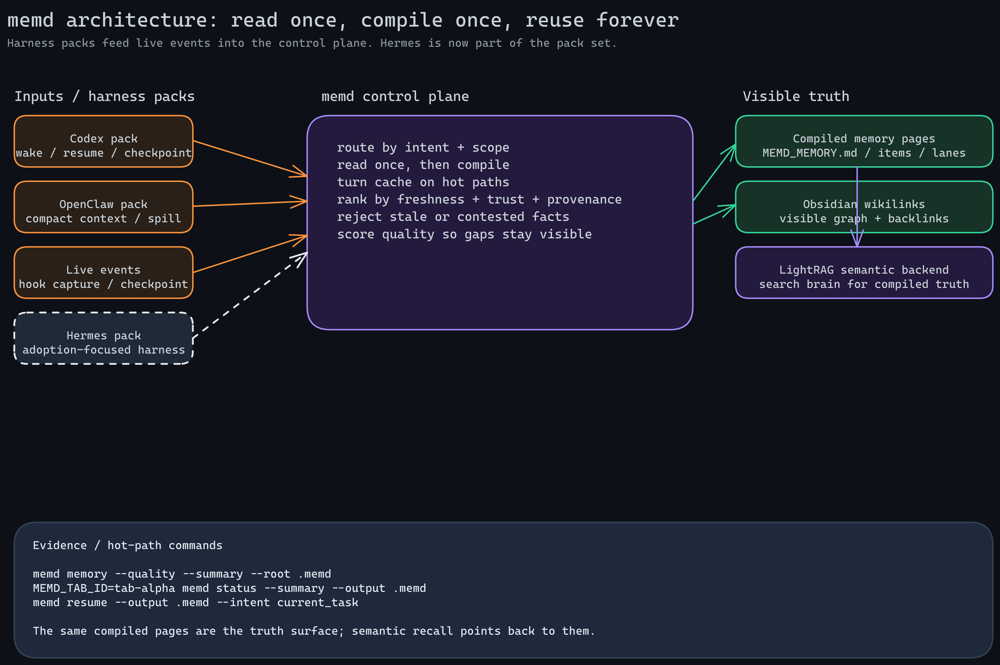

# memd

`memd` is a memory control plane and knowledge base for agents.

It turns raw work into a compact, visible, source-linked memory system that stays
usable across turns, tabs, machines, and projects. The goal is not just to store
more context. The goal is to make memory reliable: read once, compile once,
reuse forever, and always keep a path back to the evidence.

`memd` combines:

- harness packs for Codex, Claude Code, Agent Zero, OpenClaw, Hermes, OpenCode, and other agent surfaces
- compiled memory pages that stay visible on disk
- Obsidian wikilinks for human navigation
- LightRAG as the semantic recall backend
- session, tab, and project scope so hive work stays separated
- same-project sessions auto-join the same hive mesh
- cross-project links stay explicit and safety-gated
- quality scoring so gaps, stale facts, and contradictions are obvious

## What it does

- routes memory by intent, scope, and freshness
- compacts working state without transcript dumps
- keeps compiled memory pages visible on disk
- uses Obsidian wikilinks for the graph
- uses LightRAG as the semantic recall backend
- tracks session and tab scope for live hive coordination
- auto-links same-project sessions so they can find each other immediately
- scores memory quality so gaps are explicit

## Quickstart

```bash
cargo run -p memd-server
cargo run -p memd-client --bin memd -- setup --agent codex
memd status --output .memd
memd doctor --output .memd --summary
memd commands --output .memd --summary
memd resume --output .memd --intent current_task
```

If you are using Codex, `memd` can load or reload the current bundle for you.

## Architecture



See the editable source at [docs/architecture.excalidraw](./docs/architecture.excalidraw).

## Docs

- [Setup](./docs/setup.md)
- [API](./docs/api.md)
- [Architecture](./docs/architecture.md)
- [Obsidian Bridge](./docs/obsidian.md)
- [RAG](./docs/rag.md)
- [Efficiency](./docs/efficiency.md)
- [OSS Positioning](./docs/oss-positioning.md)

## Integrations

- Codex
- Claude Code
- Agent Zero
- OpenClaw
- Hermes
- OpenCode
- Obsidian
- shared hook kit

## License

AGPLv3. See [LICENSE](./LICENSE).
