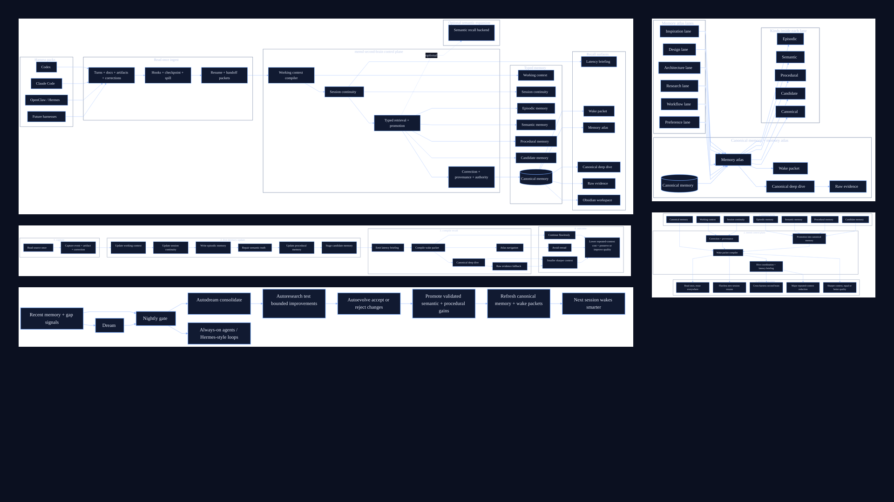
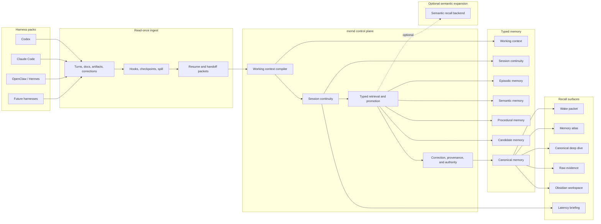

# memd

`memd` is a multiharness second-brain memory substrate for humans and agents.

It turns raw work into compact, source-linked memory that stays usable across
sessions, harnesses, machines, and projects. The point is not to store more
context. The point is to make memory reliable: read once, remember once, reuse
everywhere, and always keep a path back to the evidence.

## Start Here

- canonical entrypoint: [[START-HERE]]
- current project state: [[ROADMAP]]
- fresh-session recovery: [[docs/WHERE-AM-I.md|WHERE-AM-I]]
- current milestone: [[docs/verification/milestones/MILESTONE-v1.md|MILESTONE-v1]]
- current priority harnesses: Codex, OpenCode, Hermes, OpenClaw

## Architecture

Canonical board:

- [docs/assets/composite/memd-10-star-board-v1.png](./docs/assets/composite/memd-10-star-board-v1.png)
- [docs/assets/composite/memd-10-star-board-v1@2x.png](./docs/assets/composite/memd-10-star-board-v1@2x.png)

Supporting graphs:

- [topology](./docs/assets/memd-10-star-topology-v2.svg)
- [live loop](./docs/assets/memd-10-star-live-loop-v2.svg)
- [capability map](./docs/assets/memd-10-star-capability-map-v2.svg)
- [overnight loop](./docs/assets/memd-10-star-overnight-v2.svg)
- [lanes](./docs/assets/memd-10-star-lanes-v1.svg)



## At A Glance



## What It Is

- raw truth that stays source-linked
- typed memory kinds instead of one flat store
- session continuity that resumes real work fast
- corrections that replace stale beliefs
- provenance that lets every claim be inspected and traced
- portability across Codex, Claude Code, OpenClaw, Hermes, OpenCode, and future harnesses
- memory atlas navigation over canonical memory
- optional semantic expansion behind the control plane

## Core Loops

- capture raw work once
- compile small wake packets
- retrieve by type before giant search
- revise stale beliefs when better evidence arrives
- dream, autoresearch, and autoevolve in the background

## What It Connects

- Codex
- Claude Code
- OpenClaw
- Hermes
- OpenCode
- Obsidian
- optional semantic recall backend

## Quickstart

```bash
cargo run -p memd-server
cargo run -p memd-client --bin memd -- setup --agent codex
memd status --output .memd
memd doctor --output .memd --summary
memd commands --output .memd --summary
memd resume --output .memd --intent current_task
```

If you are using Codex, `memd` can load or reload the current bundle for you.
For an opt-in project hive, use `memd hive-project --output .memd --enable --summary`
to turn the repo on, `memd hive --output .memd --publish-heartbeat --summary` to
join the live session, and `memd hive-link` only when you need a safe link
between different projects.

## Docs

- [Setup](./docs/core/setup.md)
- [API](./docs/core/api.md)
- [Architecture](./docs/core/architecture.md)
- [10-Star Model](./docs/theory/models/2026-04-11-memd-10-star-memory-model-v2.md)
- [Obsidian Bridge](./docs/core/obsidian.md)
- [RAG](./docs/core/rag.md)
- [Efficiency](./docs/policy/efficiency.md)
- [OSS Positioning](./docs/reference/oss-positioning.md)

## Integrations

- Codex, Claude Code, OpenClaw, Hermes, OpenCode, and future harnesses
- Obsidian
- shared hook kit

## License

AGPLv3. See [LICENSE](./LICENSE).
