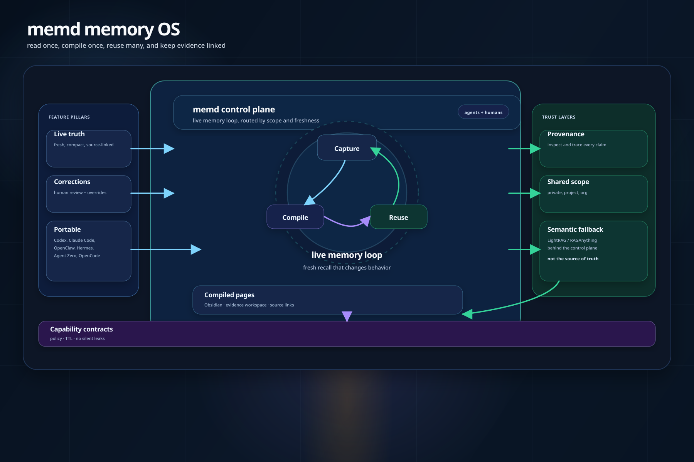
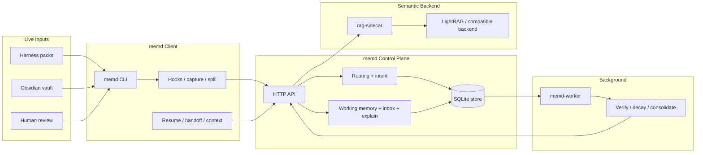

# memd

`memd` is a memory control plane for agents.

It turns raw work into compact, source-linked memory that stays usable across
turns, tabs, machines, and projects. The point is not to store more context.
The point is to make memory reliable: read once, compile once, reuse many, and
always keep a path back to the evidence.

## Architecture

The product hero source is [docs/assets/product-loop.svg](./docs/assets/product-loop.svg).
The landing-page image is [docs/assets/product-loop.png](./docs/assets/product-loop.png).
The detailed architecture image is [docs/assets/architecture-hero.svg](./docs/assets/architecture-hero.svg).
The full repo map is [docs/assets/codebase-map.png](./docs/assets/codebase-map.png).



## At A Glance



## What It Is

- live truth that stays synced while work changes
- corrections that replace stale beliefs
- provenance that lets every claim be inspected and traced
- shared scope that stays explicit across agents and humans
- portability across Codex, Claude Code, OpenClaw, Hermes, Agent Zero, and OpenCode
- compiled pages and semantic fallback behind the control plane

## Core Loops

- capture live turn state from harness packs
- compile compact evidence into visible pages
- reuse the right memory on the hot path
- revise stale beliefs when better evidence arrives
- verify, decay, and consolidate in the background

## What It Connects

- Codex
- Claude Code
- Agent Zero
- OpenClaw
- Hermes
- OpenCode
- Obsidian
- LightRAG or a compatible backend

## Quickstart

```bash
cargo run -p memd-server
cargo run -p memd-client --bin memd -- setup --agent codex
memd status --output .memd
memd doctor --output .memd --summary
memd commands --output .memd --summary
memd resume --output .memd --intent current_task
```

If you are using Codex, `memd` can load or reload the current bundle for you.
For an opt-in project hive, use `memd hive-project --output .memd --enable --summary`
to turn the repo on, `memd hive --output .memd --publish-heartbeat --summary` to
join the live session, and `memd hive-link` only when you need a safe link
between different projects.

## Docs

- [Setup](./docs/core/setup.md)
- [API](./docs/core/api.md)
- [Architecture](./docs/core/architecture.md)
- [Obsidian Bridge](./docs/core/obsidian.md)
- [RAG](./docs/core/rag.md)
- [Efficiency](./docs/policy/efficiency.md)
- [OSS Positioning](./docs/reference/oss-positioning.md)

## Integrations

- Codex, Claude Code, Agent Zero, OpenClaw, Hermes, and OpenCode
- Obsidian
- shared hook kit

## License

AGPLv3. See [LICENSE](./LICENSE).
