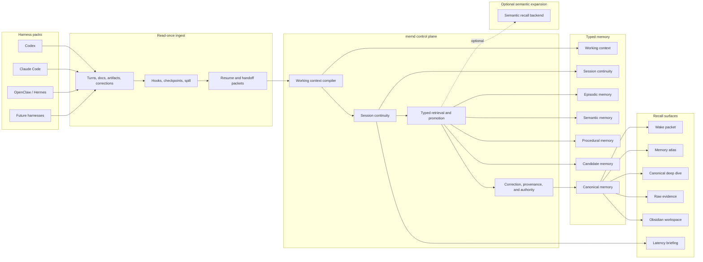

# Architecture

## Summary

`memd` is a multiharness second-brain memory substrate for the human.

It is the control plane under:

- many models
- many harnesses
- many sessions
- many agents

The design target is:

- read once
- remember once
- reuse everywhere
- resume flawlessly
- drill deeper only when needed

## Canonical Diagram

See also:

- [memd-10-star-topology-v2.png](../assets/memd-10-star-topology-v2.png)
- [memd-10-star-live-loop-v2.png](../assets/memd-10-star-live-loop-v2.png)
- [memd-10-star-capability-map-v2.png](../assets/memd-10-star-capability-map-v2.png)
- [memd-10-star-overnight-v2.png](../assets/memd-10-star-overnight-v2.png)
- [memd-10-star-lanes-v1.png](../assets/memd-10-star-lanes-v1.png)

## Native Memory Kinds

### Working Context

- tiny active packet for current reasoning
- current task, constraints, hypotheses, next move

### Session Continuity

- what we were doing
- where we left off
- blockers
- open loops
- next action

### Episodic Memory

- what happened
- when
- in what context
- with what result

### Semantic Memory

- stable truths
- decisions
- constraints
- architecture facts

### Procedural Memory

- how to do things
- workflows
- operating patterns
- learned recovery behavior

### Candidate Memory

- repeated signals not yet trusted enough
- holding lane before promotion

### Canonical Memory

- durable trusted memory
- promoted semantic, episodic, and procedural memory
- promotion is stage-aware: candidate items can be promoted to canonical stage and then carry canonical truth behavior through retrieval and resume surfaces

## Typed Memory First Slice

Current runtime slice now exposes top-level typed-memory families in live surfaces:

- `semantic`
- `procedural`
- `episodic`
- `session_continuity`
- `candidate`
- `canonical`

This does not replace stored `MemoryKind`.
It is the first behavioral bridge from storage kinds into the 10-star model.

Current live behavior:

- lookup chooses default storage kinds from retrieval intent
- lookup output prints the active retrieval plan and typed-memory targets
- bundle and resume inspection surfaces expose typed-memory labels on durable inbox items
- compiled memory quality probes now include `session_continuity`, and benchmark artifacts surface the typed retrieval evidence in `latest.md`

## Native Control Functions

### Correction And Provenance

Must keep:

- source
- freshness
- confidence
- conflict state
- promotion history

### Wake Packet Compiler

Must compile small action-ready packets that answer:

- what are we doing
- where did we stop
- what changed
- what next

### Hive Coordination

Must support:

- per-agent local working state
- shared truth
- shared procedures
- handoff packets
- latency briefing as first-hop warm start
- transport capability for future KV/prefix reuse

## Surfaces

These are surfaces over memory, not the substrate itself:

- wake packet
- memory atlas
- canonical deep dive
- raw evidence
- Obsidian workspace

## Memory Atlas

The memory atlas is the multidimensional navigation layer over canonical memory.

It is not truth itself.

It should support:

- region navigation
- linked expansion
- neighborhood traversal
- zoom from summary to evidence
- multiple dimensions at once

Dimensions include:

- time
- salience
- trust
- provenance
- memory type
- lane
- scope
- harness

Starter atlas lanes:

- inspiration
- design
- architecture
- research
- workflow
- preference

Lanes group memory by domain across kinds.

## Obsidian

Obsidian is:

- a first-class human workspace
- a readable rendered surface
- a source lane for notes and artifacts

Obsidian is not:

- the control plane
- canonical truth by itself

## Semantic Expansion

Semantic backends are optional helpers.

They may help with:

- fuzzy related-context retrieval
- long-range association
- semantic expansion

They must not:

- outrank canonical memory
- replace provenance
- become the main truth layer

## Live Loop

1. capture raw event, artifact, or correction
2. update working context
3. update session continuity
4. write episodic memory
5. repair semantic truth
6. update procedural memory
7. compile wake packet

### Phase A Raw Truth Spine

1. capture raw event, artifact, or correction
2. preserve source linkage immediately
3. write bundle-local raw spine record
4. write candidate or canonical memory
5. keep raw evidence reachable for later resume, atlas, and promotion flows

### Phase B Session Continuity

1. answer what we are doing
2. answer where we left off
3. answer what changed
4. answer what next
5. keep those answers compact enough for fresh-session resume without transcript rebuild

## Overnight Loop

1. dream
2. autodream
3. autoresearch
4. autoevolve
5. promote accepted gains into semantic, procedural, and canonical memory

## Architectural Rule

Raw truth comes first.

Everything else exists to:

- make that truth reusable
- make it navigable
- make it resumable
- make it trustworthy
- intent

The router then picks the smallest useful tier order instead of treating every query as a full corpus search.

Examples:

- `current_task` prefers local and synced state first
- `decision`, `runbook`, and `topology` prefer project memory first
- `preference` and `pattern` prefer global memory first

## Memory Inbox

The manager also exposes an inbox for items that need human or policy attention.

This is where:

- candidate memories wait for promotion
- stale canonical memories wait for verification
- contested items wait for resolution
- superseded items wait for cleanup

If the system cannot show you what needs attention, it turns into a black box. That dies fast in practice.

The server also serves a small built-in dashboard at `/` so the inbox, explain view, search, and compact context can be inspected without needing a separate frontend.

## Working Memory Controller

Working memory is a managed buffer, not just the top N search hits.

The controller should report:

- why an item was admitted
- why an item was evicted
- why an item should be rehydrated

The reasons should be policy-visible and deterministic, using factors such as:

- freshness
- source trust
- contradiction or contested state
- recent use
- verification recency

The output should stay compact on the hot path and move the detailed source trail into explain or source-memory drilldown.

## Reversible Compression

`memd` should keep the hot path compact without destroying the evidence behind it.

That means:

- compact summaries stay first
- explain and source drilldown preserve the raw artifact trail
- policy hooks stay visible so future learned retrieval can observe why the system surfaced something

## Retrieval Order

1. latency briefing
2. wake packet
3. session continuity
4. typed retrieval
5. atlas expansion
6. canonical deep dive
7. raw evidence

Compact packets should outrank raw documents.
Raw documents are fallback evidence, not the default first payload.
