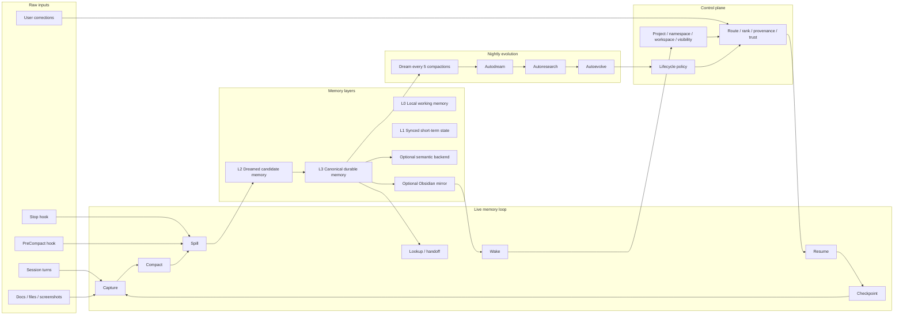

# memd 10-Star Architecture Map

## Goal

Define the canonical 10-star `memd` memory model so we stop guessing, stop
mixing layers, and stop building features that do not move us closer to beating
`mempalace`.

This map has one job: make the product truth explicit.

- what each layer does
- what writes where
- what gets read on the hot path
- what runs live versus overnight
- what is required versus optional
- what we keep from `mempalace`
- what we keep from `Hermes`
- what we cut because it is only architecture noise

If a feature does not help the memory loop, the compact loop, the spill loop,
or the overnight improvement loop, it is not core.

Visual companion removed.

The generated graph assets were discarded because they did not express the
architecture truth clearly enough to be canonical.

## Source Truth Inputs

This map is derived from:

- the `memd` roadmap and 10-star target
- the live-truth doctrine
- the public-benchmark parity target against `mempalace`
- the real `mempalace` codebase and benchmark docs
- the real `Hermes Agent` codebase and docs

What each source proved:

- `memd` says the product goal is a memory OS with live-state cognition
- `mempalace` proves raw verbatim storage plus forced save checkpoints is the
  strongest baseline we should not lose
- `Hermes` proves the always-on agent model, skills/procedural memory, cron,
  plugin hooks, and checkpointing are useful for overnight improvement loops

## North Star

The 10-star target is not one layer. It is a closed memory system with two
timing bands.

### Live band

Runs during normal work:

- ingest raw evidence
- compact into a short working view
- spill before compaction or session end
- serve recall from durable truth
- keep provenance visible

### Overnight band

Runs on always-on agents only:

- dream every 5 compactions
- autodream nightly
- autoresearch nightly
- autoevolve nightly
- promote only what still wins after re-checks

This means `memd` does not try to do every improvement continuously. It
separates fast memory from slower self-improvement.

## What Each Layer Does

### 1. Raw Input Lane

This is the source of memory.

Inputs:

- session turns
- user corrections
- docs and source files
- screenshots, logs, artifacts
- hook events
- checkpoint and compaction packets

This lane must preserve raw truth as much as possible. It is the lane
`mempalace` gets right with verbatim drawers.

### 2. Control Plane

This is `memd` proper.

Responsibilities:

- route by project, namespace, agent, visibility, and workspace
- rank by trust, freshness, and evidence
- preserve provenance and correction state
- decide what is live, candidate, canonical, or expired
- keep shared state from bleeding across scope boundaries

This lane must stay small and explicit. It is not the memory itself.

### 3. Live Memory Loop

This is the hot path.

Commands and surfaces:

- `wake`
- `resume`
- `checkpoint`
- `capture`
- `spill`
- `handoff`
- `lookup`

Flow:

1. read wake/compact truth first
2. accept current task state and corrections
3. compact the hot lane into a small usable frame
4. spill before context loss
5. write durable candidate or canonical memory

This is the layer that must survive turn boundaries.

### 4. Storage Layers

The memory stack should be layered, not flattened.

- `L0` local working memory
- `L1` synced short-term state
- `L2` candidate / dreamed memory
- `L3` canonical durable memory
- optional semantic backend
- optional Obsidian mirror

Rules:

- `L0` and `L1` are for fast current work
- `L2` is where frequent patterns get consolidated
- `L3` is the source of durable truth
- semantic and Obsidian layers are downstream, not the source of truth

### 5. Consolidation Loop

This is the memory hygiene layer.

Timing:

- `dream` every 5 compactions
- `autodream` nightly on always-on agents

Responsibilities:

- compact repeated patterns
- promote useful candidates
- merge duplicates
- repair contradictions
- seed future sessions with better compact truth

This is where the system turns live work into better memory shape.

### 6. Self-Improvement Loop

This is the optimization layer.

Timing:

- `autoresearch` nightly on always-on agents
- `autoevolve` nightly on always-on agents

Responsibilities:

- find gaps
- run bounded experiments
- update scoring, routing, and recall policies
- keep accepted improvements reversible until they prove durable

This layer must never outrank memory correctness.

### 7. Surfaces

User-facing memory surfaces must be progressive, not dump-all.

Order:

1. one-line wake summary
2. compact drawer
3. deeper drawer
4. raw evidence

These surfaces exist to keep recall token-efficient while still making the
system inspectable.

## What We Keep From MemPalace

Keep these ideas:

- raw verbatim storage first
- force-save on `Stop`
- always-save on `PreCompact`
- taxonomy/room routing as a retrieval aid
- local-first, no-cloud memory when possible
- no lossy extraction on the hot path

Do not copy these as-is:

- the palace naming if it becomes cute but unclear
- any summary layer that replaces raw evidence
- any claim that architecture alone is the moat

## What We Keep From Hermes

Keep these ideas:

- always-on agent mode for 24/7 systems
- skill creation from repeated workflows
- memory provider abstraction
- cron-driven fresh sessions
- checkpoint / rollback before destructive changes
- hooks at lifecycle boundaries
- plugin system for extending capabilities without core churn

Do not copy these as-is:

- bounded file memory as the only durable store
- generic “self-improving” branding without proof
- any layer that makes the agent look smart while hiding the actual memory flow

## What We Cut

Cut or demote anything that does not help beat `mempalace`.

Examples:

- pretty diagrams without data flow
- semantic backend claims without actual ingest
- Obsidian-only mirror behavior that does not improve retrieval
- self-evolution features that do not improve memory correctness
- any layer that is always-on only in branding, not in behavior

## Canonical Flow

## Timing Rules

- `Stop` hook means save now, do not trust the session to survive
- `PreCompact` hook means save now, because context is about to be lost
- `dream` means compact repeated patterns after every 5 compactions
- `autodream` means nightly consolidation on always-on agents
- `autoresearch` means nightly gap discovery and experiment selection
- `autoevolve` means nightly improvement promotion where allowed

## Implementation Order

The plan should build in this order:

1. prove raw save triggers at `Stop` and `PreCompact`
2. prove compact surfaces are progressive and token-efficient
3. prove spill lands durable truth before compaction/session end
4. prove corrections override stale memory
5. prove overnight dream/autodream/autoresearch/autoevolve only on always-on agents
6. prove fresh sessions recover the right drawers without rereading everything
7. only then expand into optional semantic and wiki layers

## Success Criteria

`memd` is at the 10-star bar when:

- a fresh session gets the right truth from the wake/compact path
- stop and precompact both force memory preservation
- compaction reduces context without losing the important thing
- spill lands durable memory before the turn disappears
- nightly evolution improves the system without regressing recall
- `mempalace` no longer has the simpler or stronger core loop
- `Hermes` is matched where always-on self-improvement matters

## Non-Goals

- building a pretty architecture diagram that does not match runtime truth
- treating Obsidian or semantic RAG as the foundation
- pretending self-improvement is core if it does not improve memory
- mixing benchmark claims with operator health claims
